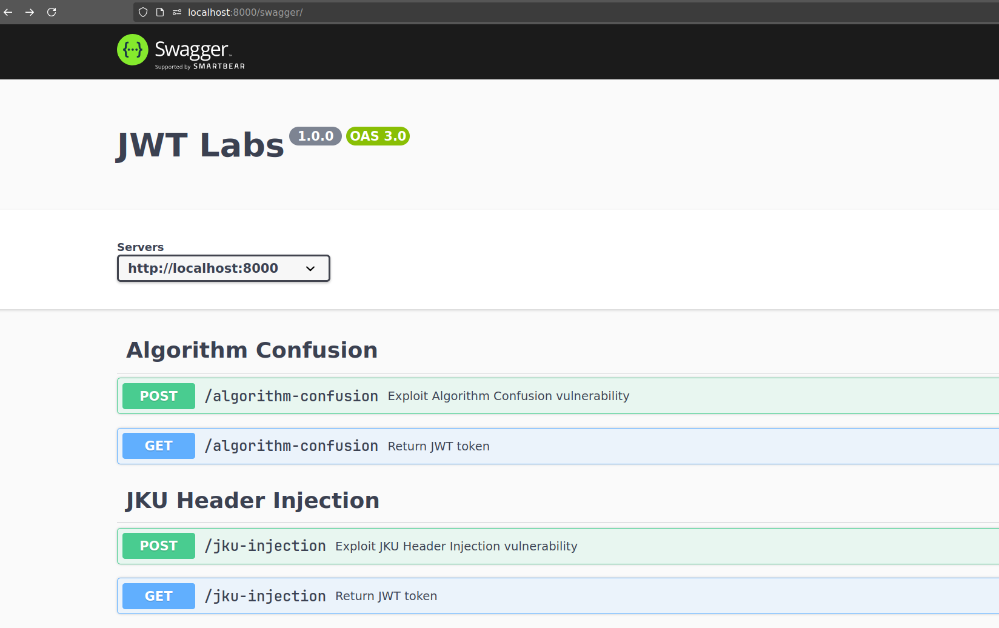

# JWT Vulnerabilities - Lab

This lab was developed to demonstrate vulnerabilities in the JWT signature system.

### Implemented vulnerabilities.
- [x] Weak Secret
- [x] None Attack
- [x] KID Header Injection - SQL Injection and Path Traversal
- [x] JKU Header Injection
- [x] Algorithm Confusion

### Setup

Run the commands below to initialize the lab:

```
git clone https://<link-here>
cd jwt-vulnerabilities-lab
docker build . -t jwt-vuln-lab
docker run -d -p 8000:8000 -it jwt-vuln-lab
```

Accessing the lab:

